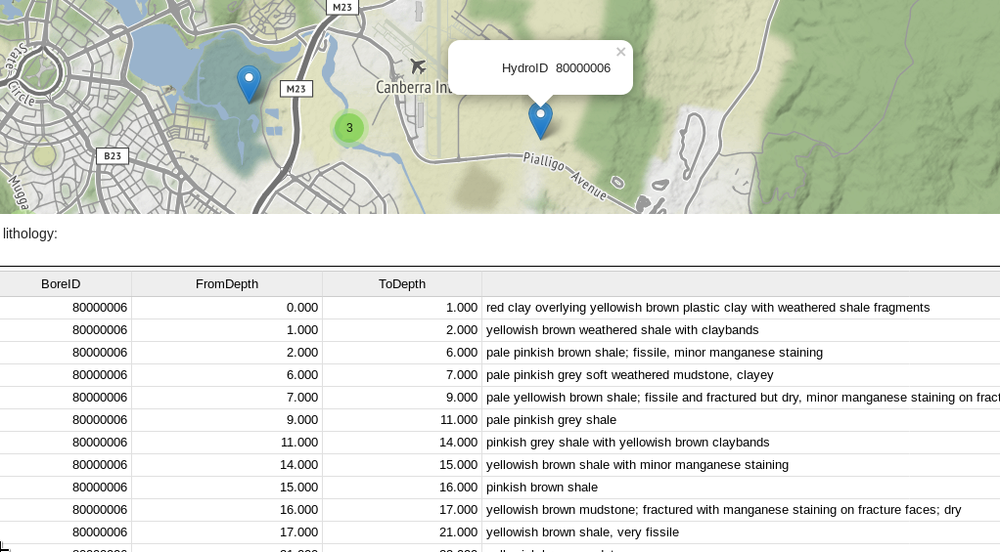

## Borehole lithology logs viewer

[](https://mybinder.org/v2/gh/csiro-hydrogeology/lithology-viewer/30f3a3b9e3729c7f5848fa3cee6614c801e22ee7?urlpath=voila%2Frender%2Fapp.ipynb)

Prototype explorer of borehole data used for [exploratory lithology analysis](https://github.com/csiro-hydrogeology/pyela). Powered by [Voila](https://github.com/QuantStack/voila), [ipysheet](https://github.com/QuantStack/ipysheet) and [ipyleaflet](https://github.com/jupyter-widgets/ipyleaflet)




## Usage

```bash
voila app.ipynb
```

To automatically cull idle kernels:

```bash
voila --MappingKernelManager.cull_interval=10 --MappingKernelManager.cull_idle_timeout=10 app.ipynb
```

## Acknowledgments

This sample is derived from the [voila-gpx-viewer](https://github.com/jtpio/voila-gpx-viewer)